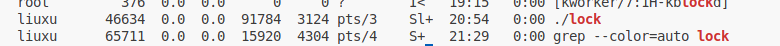
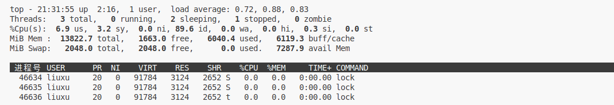
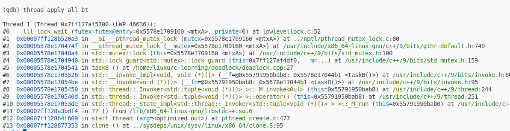
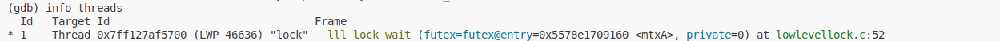
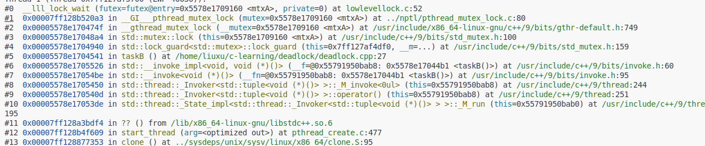

## 死锁gdb调试
获得进程状态
ps aux | grep deadLock

查看cpu利用率
top -Hp 6586

进入gdb调试
sudo gdb attaach 46634
查看堆栈的调用情况
thread apply all bt

查看所用线程
info threads

使用 thread + 线程索来切换到某个线程：thread 1
使用 bt 来查看堆栈当前线程的堆栈调用：
